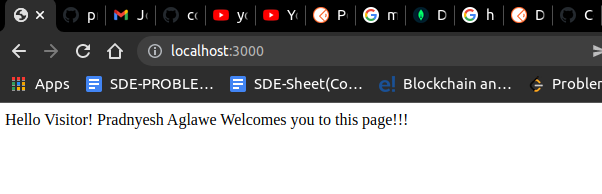
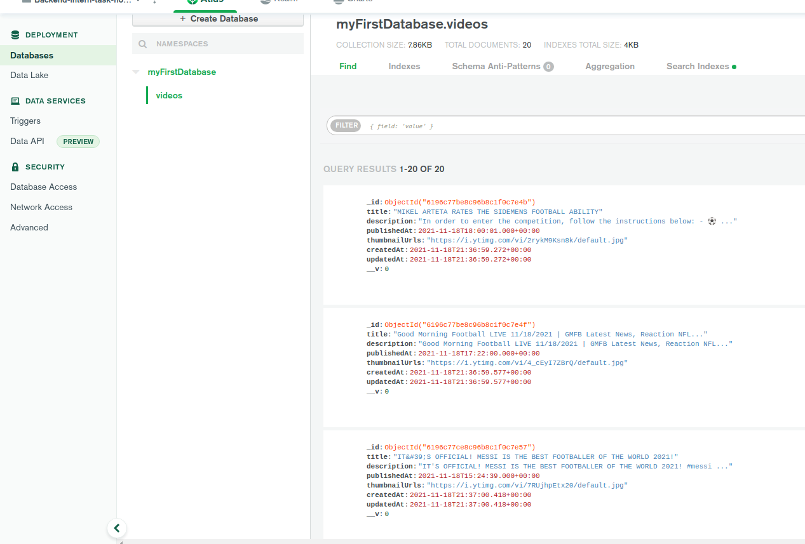
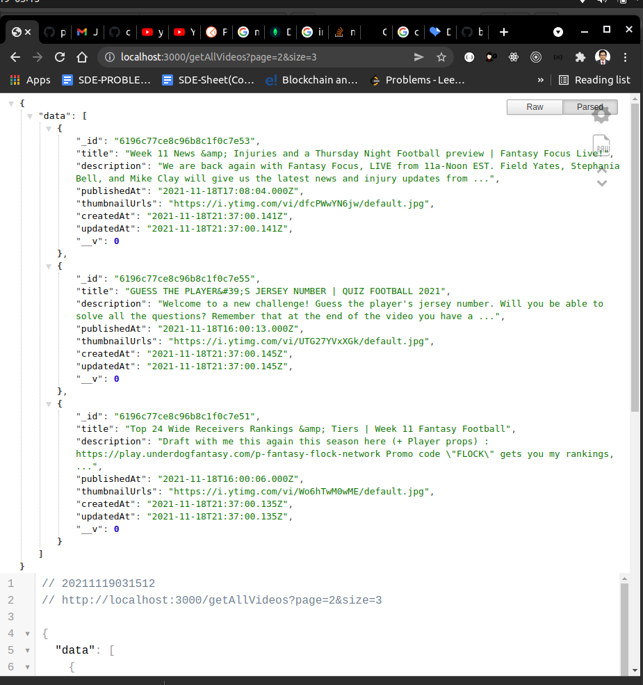
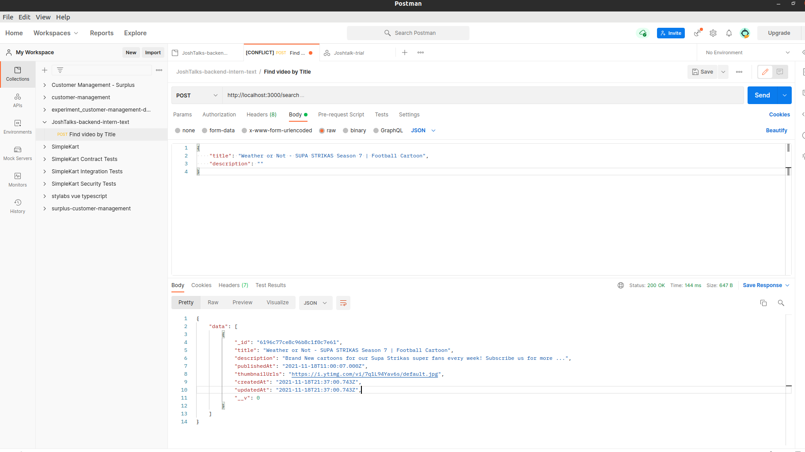

# Readme for backend-internship-task

- Tech Stack: NodeJS, ExpressJS, MongoDB

## How to get started?

1. clone the repository in your local system
2. Go to the folder of the project.
3. Make a .env(all your secrets are kept here) file similar to envsample.txt
4. Place your google API key in GOOGLE_TOKEN and mongo uri in MONGO_URI in the .env file after creating new mongo atlas project.
5. Make sure Node and npm is install with correct versions. (node >= 12)
6. Run `npm install`, it will install all the dependencies

## How to run the server?

1. Go to the directory where this project is located.
2. Now type `npm run dev`. It will run the nodemon command

## How to verify if the APIs are working?

Ensure that the server is running on port 3000

### Task1: To continuously run the server every 10 seconds and based on a specific query, store the required data in the database

1. I have used "football" as a search query.
2. I have used maxResults as 20.
3. After running the server for 10 seconds, you will see that the database now has 20 enteries related to football.

### Task2: A GET API which returns the paginated response in descending order by PublishedAt Date

1. On the endpoint /getAllVideos, by passing page and size we can tell which page and how many documents we want to retrieve.
2. Eg. Here, localhost:3000/getAllVideos?page=2&size=3

### Task3: Post request which gets us the document of video with help of title or description or both.

1. Post request on endpoint /search
2. Make a post request by passing the title or description or both into the request body.

### Contact in case of problems

2. Email: pradnyeshaglawe12@gmail.com
